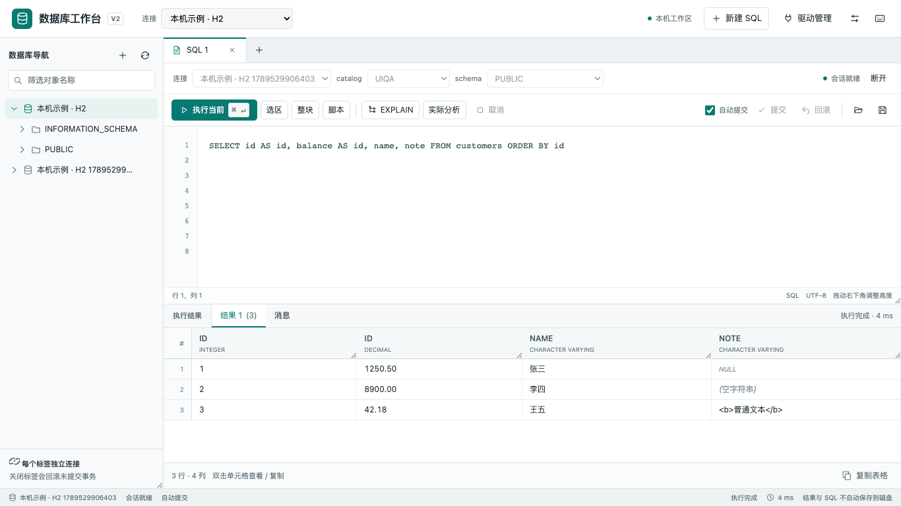
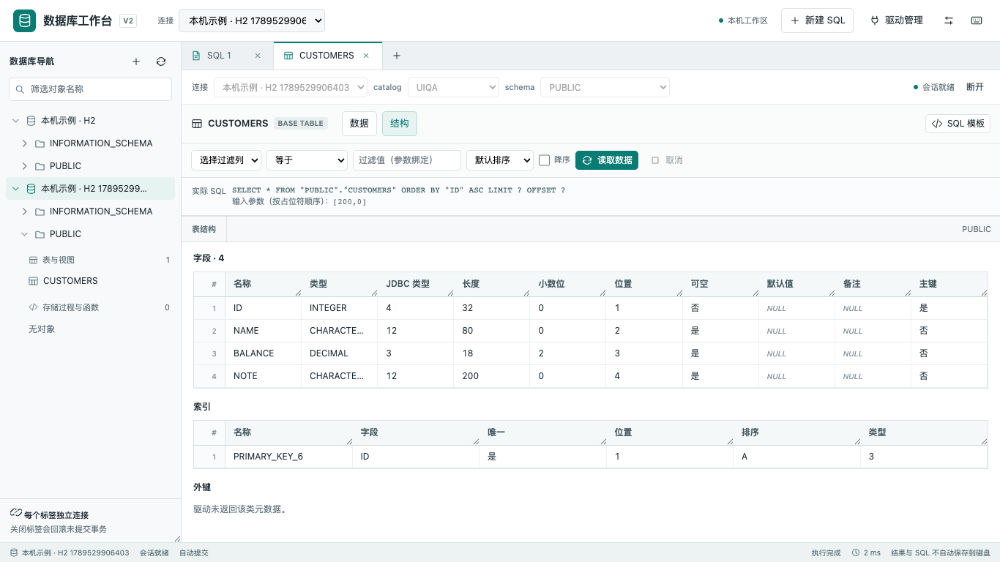
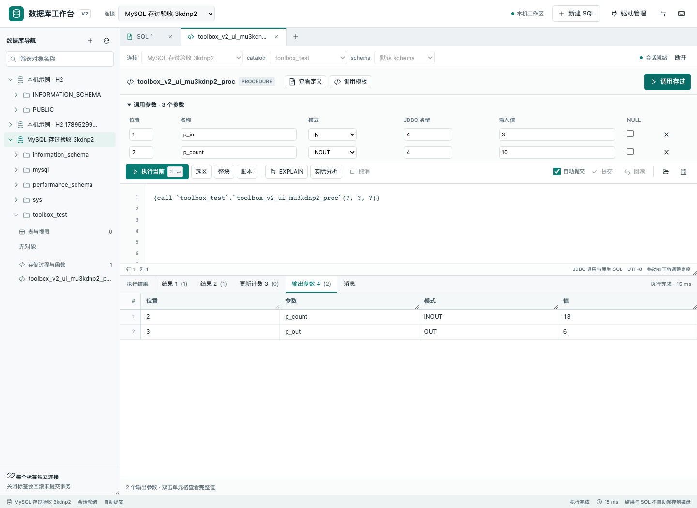
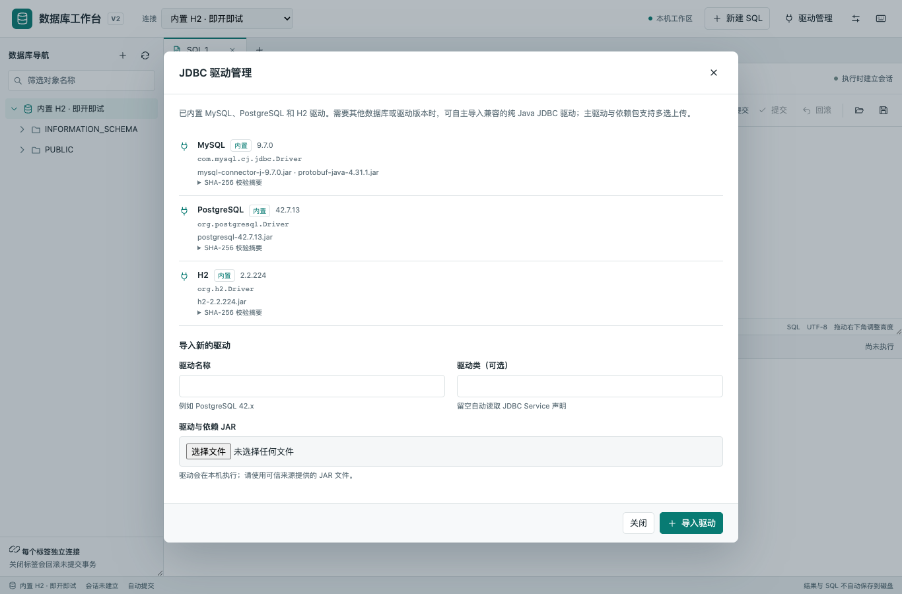
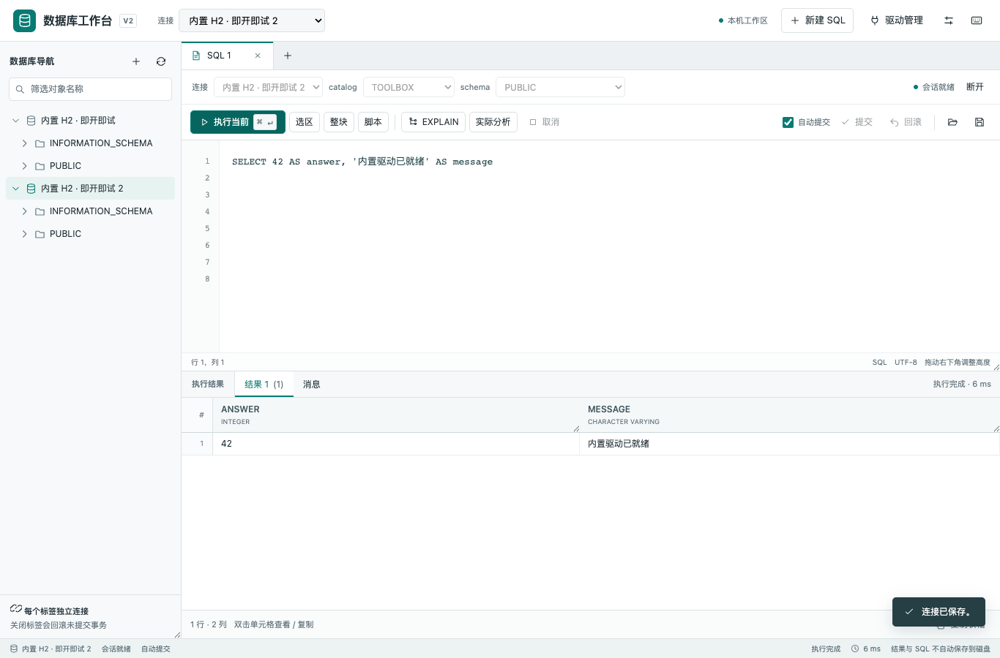

# V2 交付与验证记录

日期：2026-09-16。版本：2.0.0。**核心工作台已实施，单 JAR 已生成并验证；GaussDB/Oracle 与跨操作系统兼容性尚未完成现场验收。**

## 1. 交付物

- [可执行 JAR](https://github.com/makotogu/database-toolbox/releases/download/v2.0.0/database-toolbox.jar)，27,871,223 字节（约 26.6 MiB）。
- [SHA-256 文件](https://github.com/makotogu/database-toolbox/releases/download/v2.0.0/database-toolbox.jar.sha256)。
- [启动说明](https://github.com/makotogu/database-toolbox/releases/download/v2.0.0/README.txt)与[完整使用说明](../../README.md)。
- [配套启停脚本](https://github.com/makotogu/database-toolbox/releases/download/v2.0.0/database-toolbox.sh)，源码见 [scripts/database-toolbox.sh](../../scripts/database-toolbox.sh)。
- [开发指南](../../DEVELOPMENT_GUIDE.md)。

```text
305ff756b01c02de1d66307c899dd88b107f17edd80b947af78f28b8ce446b8a
```

在已安装 Java 8 的可写目录运行：

```bash
java -jar database-toolbox.jar
```

访问 `http://127.0.0.1:8080`。页面和服务均在 JAR 内，应用启动不需要 Maven、Node、Docker 或联网下载资源。默认提供 MySQL 9.7.0（含 protobuf-java 4.31.1）、PostgreSQL 42.7.13、H2 2.2.224，首次启动即可选择；仍可从页面导入其他驱动。内置驱动作为 JAR 资源隔离加载，驱动和连接配置保存在自动创建的 `data/`。连接远端数据库仍需数据库网络可达。

`dist/` 和 `target/` 是本地生成目录，不加入 Git；源码构建产物为 `target/database-toolbox.jar`。本记录中的摘要绑定本次交付物，重新构建后应重新生成摘要。机器可读信息见 [artifact.json](evidence/artifact.json)。

## 2. 已完成的改造

| 用户需求 | 当前实现 |
| --- | --- |
| 自选驱动 | 默认三类驱动，页面导入主包与依赖包、SPI 候选/手填驱动类、摘要校验、按配置隔离类加载；连接直接使用所选 Driver |
| 数据库查询 | 多 SQL 标签、独立会话、当前语句/选区执行；结果按列位置保存，保留重复列名与精确数值 |
| 存储过程 | 对象树、定义/参数、可修改调用模板、IN/OUT/INOUT/RETURN、多结果集和更新计数 |
| 代码块和脚本 | 整块执行，MySQL DELIMITER、PostgreSQL dollar quote、声明块与独占行 `/` 的词法处理；同会话顺序执行，出错停止 |
| EXPLAIN | 估算计划与实际分析分开；保留原始计划，PostgreSQL JSON 计划可显示树形结构 |
| 可视化预览 | 对象树、字段/主键/索引/外键、表内容筛选/排序/分页、单元格预览与复制 |
| 会话与事务 | 自动提交、提交/回滚、超时、取消及必要时断开；无法确认终止结果时显示结果未知 |
| 简化与迁移 | Java 运行源码由 64 个文件收敛为 26 个；同步、分区、备份与旧 job 不进入 V2 编译/运行包；旧连接迁移与备份 |

旧版源码连同开始实施时已有的未提交修改保存在 [legacy/v1](../../legacy/v1/ARCHIVE.md)。95 个原始源码/构建/说明文件与实施前 manifest 的 SHA-256 全部一致。完整工作区快照另存 `.local-backups/20260916-110930/`，不包含真实数据目录；本次测试没有读取或修改用户现有 `data/`。

## 3. 测试环境与结果

环境：macOS 27.0 arm64，Amazon Corretto Java 1.8.0_452，Spring Boot 2.7.18。浏览器使用本机 Google Chrome。真实数据库均为本次创建的临时 Docker 容器，仅暴露回环端口；测试对象、连接和会话由脚本清理。

| 验证层 | 结果与证据 |
| --- | --- |
| Java 8 test + package | **57 项测试通过，0 失败/错误/跳过**；[测试汇总](evidence/unit-tests.json) |
| MySQL/PostgreSQL 最终 JAR 集成 | **19 条检查通过**，包括启动、内置驱动选择与清理检查；[内置驱动复测日志](evidence/default-database.jsonl) |
| 独立发行验证 | **9 条检查通过**；中文与空格临时目录、仅拷入 JAR、静态资源、4 类非法本机请求、内置 H2 无上传查询、自选驱动共存、双实例锁、重启后的真实查询；[日志](evidence/default-release.jsonl) |
| 浏览器 | 驱动上传、连接测试/保存、脚本、重复列、NULL/空字符串/HTML 文本、单元格详情、EXPLAIN、对象树、表结构、绑定筛选已实际操作；1366×768、1920×1080、390×844 已检查，无页面脚本/控制台错误；[日志](evidence/browser-qa.log) |
| 存过页面 | 真实 MySQL 对象树进入调用页面，IN=3/INOUT=10，结果一重复 id 列为 3/6，结果二保留中文与分号，输出 p_count=13、p_out=6；执行确认一次，pageerror=0；[日志](evidence/routine-qa.log) |
| 静态检查 | `node --check`、`git diff --check` 通过；JAR 中 4 个静态资源逐字节匹配源码；内置驱动只在 `BOOT-INF/classes/bundled-drivers/`，不在应用依赖路径 `BOOT-INF/lib/`；不含旧业务类 |

默认驱动补充后，57 项 Java 测试通过（含4项新增的安装/隔离/幂等/恢复测试），随后打包并验证发行 JAR。内置列表、H2 模板、手工 URL 保留、无上传创建连接与查询、390px 窄屏均通过浏览器实测，无控制台错误；[本次页面日志](evidence/default-browser.log)。Browser plugin 未提供，使用本机 Chrome + Playwright。

### 数据库与驱动矩阵

| 数据库 | 本次使用的内置驱动 | 实际通过的重点场景 |
| --- | --- | --- |
| MySQL 8.4.8 | Connector/J 9.7.0，`com.mysql.cj.jdbc.Driver` | DELIMITER 创建过程、INOUT/OUT、两个结果集、重复列名、请求去重、脚本遇错停止、含 `%/_` 表名、参数化分页、EXPLAIN |
| PostgreSQL 16.15 | JDBC 42.7.13，`org.postgresql.Driver` | DO 块、同会话临时表、NOTICE、函数 RETURN、JSON 计划、从第二会话验证回滚、pg_sleep 取消后会话复用 |
| H2 2.2.224 | `org.h2.Driver` | Java/浏览器基本链路、表结构、查询和函数、空目录内置驱动、文件库重启查询 |
| Oracle / GaussDB | 未提供现场驱动与数据库 | 方言/词法已有代码与部分单元测试，真实存过、块、元数据和计划 **未验证** |

MySQL 驱动 SHA-256：`0353648eaa1c91e0f4020c959abf756bc866ffd583df22ae6b6f6e0cbd43eb44`。

PostgreSQL 驱动 SHA-256：`6e0e4cc2d8cae902084f8a2b18728b073a6fd9d1f87c9d8bff8f298c18185b93`。

这些结果只证明上述组合。驱动可导入不等于该数据库的所有厂商功能均已适配；PostgreSQL 成功不能代替 GaussDB 验收。

### 可重复的验证入口

```bash
# 使用 JDK 8
mvn clean verify
node --check src/main/resources/static/workbench/app.js

# 空目录、默认驱动、发布物、重启与本机访问边界
python3 scripts/verify-release.py \
  --jar target/database-toolbox.jar \
  --java /path/to/java8/bin/java

# 真实库用例仅面向可删除的一次性测试环境
python3 scripts/smoke-v2.py --help
```

验证脚本使用 Python 标准库；这是开发验证依赖，应用运行不需要 Python。最终 JAR 实测监听 `127.0.0.1`，验证数据存储于临时目录。

## 4. 与原验收清单的对应关系

原 [ACCEPTANCE.md](ACCEPTANCE.md) 包含比用户核心需求更广的边界场景。下表区分已获得证据的路径与仍需补测的部分，不把整组部分验证记作全量通过。

| 验收范围 | 本次证据 | 尚未覆盖的主要部分 |
| --- | --- | --- |
| A00–A03 基线 | 快照与95文件摘要核对；原32项基线、新57项测试；受测矩阵 | GaussDB 产品/模式/驱动组合 |
| A10–A14 驱动连接 | 外置驱动真实 JAR、依赖/隔离/错误驱动自动测试、密码和属性语义、重启 | 同名版本及拆包场景仅自动测试，未在最终 fat JAR 重复全部组合 |
| A15–A18 执行基础 | 会话、混合结果、0计数、幂等、精度/截断、真实多结果 | 长期满额压力、所有厂商大对象/时区组合、缓存过期压力 |
| A20–A27 预览界面 | H2/MySQL/PG 元数据、引用与绑定分页、三个尺寸的浏览器检查 | 选中行复制与缓存内翻页交互未实现；现有单元格/整表复制、数据库分页 |
| A30–A34 存过和块 | MySQL 参数/多结果/DELIMITER，PG RETURN/DO，词法边界测试 | 任意厂商重载、游标及参数类型组合未穷尽 |
| A35–A37 范围与失败 | Oracle风格块的词法测试、执行范围测试、真实脚本停止 | GaussDB 真实块未验证 |
| A38–A42 事务与计划 | 真实 PG 回滚/取消/计划；MySQL EXPLAIN；令牌失效、阻塞取消后 abort 自动测试 | 真实断网、所有厂商取消语义与实际分析副作用矩阵 |
| A50–A52 迁移清理 | 原类型、备份、幂等、损坏/空文件/密钥异常自动测试；归档不入运行包 | 强杀迁移进程、旧 JAR 数据回退流程未端到端实测 |
| A53–A57 发布 | 空目录/中文路径、资源、本机校验、锁、重启、摘要与启动说明 | Windows/Linux、端口冲突专项、厂商 Windows 文件句柄释放 |

## 5. 当前边界与后续验收

- 首版 SQL 编辑器为原生文本区，支持行号、选区和快捷键；语法高亮、智能补全、持久工作区恢复尚未实现。SQL 由用户主动下载保存，结果不自动落盘。
- 结果默认有行数、单元格及总量上限；复制的是当前预览内容。表内容翻页会重新执行查询，不提供稳定快照或全表导出。结果缓存保存完整受限预览，不提供缓存分页交互。
- 新驱动版本通过新配置导入后切换连接，未实现驱动版本管理界面。删除被引用驱动会阻止；少数厂商线程持有文件句柄时，删除配置后的闲置目录可能残留，尚无自动重启清理队列。
- JDBC 驱动在进程内运行，平台接口调用已设置对应上下文加载器并关闭受管资源；厂商原生库、自建线程、具体类 unwrap 及不响应取消的内部行为不能由通用层完全控制。
- 未验证 GaussDB/Oracle 和 Windows/Linux。GaussDB 下一步需提供确切产品、版本、兼容模式和 JDBC 主包/依赖；使用可创建测试表与过程的一次性环境补齐 A03/A35 等现场用例。
- 本次保留 Java 8/Spring Boot 2.7.18 的既有约束；未做框架版本升级或引入更多部署组件。

## 6. 界面证据

查询结果，重复列名、NULL 与空字符串：



表结构与索引：



其他截图：[表内容](evidence/table.png) · [1920×1080](evidence/wide.png) · [窄屏](evidence/mobile.png)。

MySQL 存储过程调用与输出参数：



## 7. 默认驱动补充

内置驱动不可删除/改类；升级可另行导入，不覆盖用户已有驱动或连接。重启不会重复添加默认项，已提取的内置文件缺失/损坏时从发行 JAR 恢复。版本、来源、摘要见 [清单](../../src/main/resources/bundled-drivers/catalog.json)，许可原文与依赖声明见 [third-party](../../src/main/resources/third-party/README.txt)。GaussDB 仍需提供匹配现场的驱动，未以 PostgreSQL 驱动替代。





## 8. 配套启停脚本

`database-toolbox.sh` 与 JAR 放在同一目录，支持 `start / stop / restart / status`。后台运行、独立日志、PID 记录和并发启停锁；停止前校验进程的唯一启动标识，使用 TERM 优雅退出，超时不自动强杀。运行目录固定为 JAR 所在目录，支持中文与空格路径。

macOS + Java 8 的实际 JAR 验证共10项通过：未运行状态、缺 JAR 报错、异目录启动、重复启动、默认驱动就绪、读取记录端口、重启更换进程、独立日志、重复停止、伪造 PID 指向其他进程时不发送信号。见 [验证记录](evidence/launcher.json)。已通过 `sh -n`，尚未在 Linux 主机实测。此次只新增脚本和说明，JAR 内容及摘要不变。
