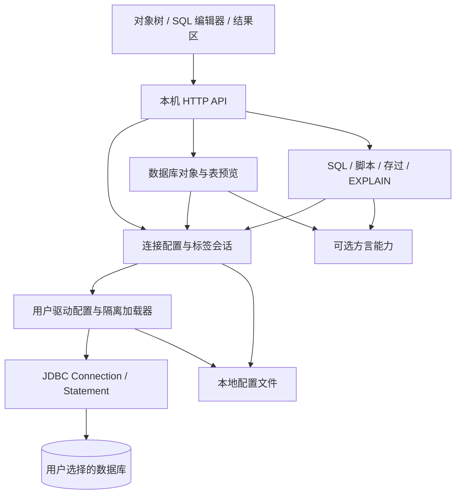

# 数据库工作台 V2：重构方案

日期：2026-09-16。状态：**V2 已实施，待目标环境验收**。

本文件保留重构启动时的设计记录。“代码块”指数据库匿名块、过程体，同时支持多语句脚本；当前 V2 实现继续交付一个可用 `java -jar database-toolbox.jar` 启动的 JAR。

**阅读说明：** 以下正文中的“计划”“建议”“尚未实施”等表述属于原始设计语境，不代表当前交付状态。具体目录、API、事务语义、资源上限及已验证范围，以当前实现、[使用说明](../../README.md)、[开发指南](../../DEVELOPMENT_GUIDE.md)和[交付与验证记录](DELIVERY.md)为准。尤其是手动切回自动提交时，当前实现会先回滚未提交事务；驱动目录为 `data/drivers/<id>/`。

配套文档：[分阶段验收清单](ACCEPTANCE.md) · [现状证据与验证记录](BASELINE.md)

补充需求已实施：默认提供 MySQL、PostgreSQL、H2 驱动，仍支持用户导入；以 [交付记录](DELIVERY.md) 和根 README 为准。

## 1. 目标与约束

将当前“数据同步/备份测试工具箱”收敛为本地数据库工作台。主要路径：**导入驱动 → 创建连接 → 浏览对象 → 编写/执行 SQL、存过或代码块 → 查看数据及执行计划**。

| 项目 | V2 决策 | 依据 |
| --- | --- | --- |
| 启动与交付 | 一个应用 JAR，`java -jar database-toolbox.jar`，浏览器访问本机地址 | 本轮用户要求 |
| Java | 保持 Java 8；应用依赖与用户导入驱动都必须兼容 Java 8 | `DEVELOPMENT_GUIDE.md:215`、`pom.xml:20` |
| 后端 | 保持单模块 Maven、Spring Boot 2.7.x；先沿用现有版本，依赖更新单独验证 | 当前构建基线；不把框架迁移混入功能重构 |
| 前端 | 原生 ES6、CSS、静态资源全部装入 JAR；不增加前端构建步骤 | `DEVELOPMENT_GUIDE.md:24` |
| 运行环境 | 需要本机 Java 8 和浏览器；不要求 Maven、Node、Docker、外部配置数据库 | 目标交付约定；Docker 仅供开发测试 |
| 网络 | 页面和资源离线可用；连接远端数据库仍需相应网络 | 目标交付约定 |
| 数据 | 默认监听 `127.0.0.1`；连接配置本机加密保存 | 现有约束，见基线 E01/E06 |
| 驱动 | 用户在页面选择一个或多个本地 JAR，应用复制保存并加载；不修改 `pom.xml`、不重打包 | 本轮用户要求 |

“单 JAR”指应用发行物。首次运行可以自动生成 `data/` 保存驱动和配置；无需用户事先搭目录。数据库驱动是用户提供的资源，Java 运行时不包含在 JAR 中。

## 2. 首个完整版本的范围

下表全部属于首个完整 V2，不能把仅能连接并查询的阶段版本当作最终交付。

| 能力 | 用户可见行为 |
| --- | --- |
| 驱动管理 | 导入主 JAR 与依赖 JAR、检测/手填驱动类、建立驱动配置、显示版本与校验摘要 |
| 连接管理 | 选择驱动、输入完整 JDBC URL、用户名/密码及属性；测试、保存、编辑、断开 |
| 对象浏览 | 懒加载 catalog/schema、表、视图、存储过程与函数；搜索、刷新 |
| 表结构预览 | 字段、类型、可空、默认值、备注、主键、索引、外键；数据库不提供的内容明确显示状态 |
| 表内容预览 | 默认取前 200 行；分页/继续加载、按列排序与过滤、单元格查看和复制；展示实际 SQL |
| SQL 工作区 | 多标签编辑、连接和 schema 上下文；执行当前语句、选区、整块、完整脚本 |
| 存储过程 | 查看定义和参数、生成调用模板；支持 IN/OUT/INOUT、函数返回值、多结果集；允许 SQL 创建/修改过程 |
| 代码块与脚本 | 匿名块与过程体保持完整；多语句在同一连接顺序执行，错误定位到语句/源码范围 |
| 执行结果 | 多个结果标签、更新计数、OUT 参数、消息/警告、耗时、取消、超时、截断提示 |
| EXPLAIN | 普通计划入口、原始输出、已适配格式的树形/表格视图；单独区分实际执行分析 |
| 会话与事务 | 每个编辑标签拥有独立 JDBC 会话；自动提交/手动提交、回滚和事务状态 |

本轮简化提案：V2 主界面移除同步模板、分区自动创建、ZIP 备份恢复和统计首页；查询结果复制保留。全库迁移、批量同步、表格直接改数据、ER 图、过程调试器、定时任务、多用户服务均不属于首版。已有功能与本地文件的退出方式见第 9 节。

## 3. 产品布局

```text
┌ 连接 ▼  schema ▼                 新建 SQL    驱动管理    设置 ┐
│ 对象树           │ SQL 1  ×  │ SQL 2  ×  │ 表：orders      │
│ ▾ 测试连接       ├──────────────────────────────────────────┤
│   ▾ schema       │ 执行当前 / 选区 / 整块 / 脚本  EXPLAIN  │
│     表 / 视图    │ 取消   自动提交 ▼   提交   回滚          │
│     存过 / 函数  │                                          │
│                  │ SQL 编辑区域                             │
│                  ├──────────────────────────────────────────┤
│                  │ 结果 1 │ 结果 2 │ 更新计数 │ 输出参数     │
│                  │ 表格 / 单元格详情 / 计划 / 消息           │
├──────────────────┴──────────────────────────────────────────┤
│ 当前连接 · 会话状态 · 事务状态 · 执行耗时 · 返回行数/截断     │
└─────────────────────────────────────────────────────────────┘
```

- 双击表打开“结构 / 数据”标签，双击存过打开“定义 / 参数 / 调用”标签。
- 切换标签不重建工作区；未保存文本、结果、选区和连接上下文分别保存。
- 工具栏写清执行范围；整块执行为显式操作，避免用户误以为它等于执行整个脚本。
- SQL 编辑区先封装原生文本编辑、行号、缩进、选区与快捷键。语法高亮/智能提示可以局部替换组件，不阻塞核心交付，也不自行编写完整编辑器。
- 结果表格用列序号标识列，支持固定表头、列宽调整、横向滚动、空值标识和大单元格详情；表数据首版只读。
- 计划只绘制实际返回的指标，不把估算 cost 显示成执行毫秒，不把未执行节点画成实测耗时。

## 4. 架构：保留单体，调整核心边界



建议包结构（保持 `com.example.dbtoolbox` 包前缀）：

```text
driver/       DriverProfile、DriverStore、DriverLoader、DriverController
connection/   ConnectionProfile、ConnectionStore、ConnectionFactory、SessionService
metadata/     MetadataService、TablePreviewService、对象与字段模型
execution/    ExecutionService、ScriptSplitter、RoutineService、ExplainService、ResultReader
dialect/      DatabaseCapabilities、GenericJdbcDialect、MySqlDialect、PostgresDialect、GaussDbDialect
storage/      版本化配置、旧配置迁移、本地锁、原子写入
common/       响应、异常、ID、脱敏、资源上限
```

Controller 负责请求校验与返回值；Service 负责用例；DriverLoader 负责类加载生命周期。只在数据库行为确实不同处增加接口，不引入插件市场、微服务、ORM 或通用工作流引擎。结果和异步状态属于 `execution`，不再依赖同步/备份领域的 `job` 模型。

### 4.1 驱动与方言解耦

驱动解决“如何建立 JDBC 连接”；方言解决“如何取对象定义、生成表预览/EXPLAIN、识别脚本边界”。导入驱动不等于获得所有厂商扩展能力。

`DriverProfile` 包含 `id、revision、name、driverClass、jarFiles[]、sha256[]`；`ConnectionProfile` 包含 `driverId/revision、jdbcUrl、properties、username、password、dialectHint`。`DatabaseType` 不再是允许连接的白名单。

加载流程：

1. 页面多选文件上传，主包及依赖放在同一配置下；不要求用户输入浏览器无法提供的真实文件路径。
2. 校验 JAR 格式、大小与文件名；由应用生成存储路径，拷贝到 `data/drivers/<id>/<revision>/`。
3. 优先从 `META-INF/services/java.sql.Driver` 发现候选，也允许手填类名；多个候选由用户选择。不逐个初始化所有 class。
4. 一个驱动版本一套 `URLClassLoader`；父加载器仅提供 Java/JDBC 平台类，厂商依赖来自该配置的 JAR，避免应用中同名驱动覆盖用户选择。必要时在调用期间设置并恢复线程上下文加载器。
5. 创建所选 `java.sql.Driver`，调用 `acceptsURL` 和 `connect(url, properties)`；返回 null 视为 URL 不匹配。不依赖全局 `DriverManager` 自动选择版本。[JDBC Driver 文档](https://docs.oracle.com/javase/8/docs/api/java/sql/Driver.html)
6. 属性在 `Properties` 中传入；用户名/密码及属性冲突采用明确规则并提示，控制字段不混入 JDBC 属性。对厂商的 URL/属性优先级分别测试。
7. 驱动版本不可原地覆盖；已有会话仍绑定原版本，新会话使用新版本。存在引用时禁止删除，释放连接后再关闭加载器。[URLClassLoader 文档](https://docs.oracle.com/javase/8/docs/api/java/net/URLClassLoader.html)

M1 同时移除应用运行依赖中的固定 MySQL 驱动；测试驱动仅作测试依赖或测试资源。部分驱动会创建线程或自行注册到 DriverManager，释放时只清理本配置拥有的资源；无法安全卸载的版本标记为“重启后清理”，不能用关闭加载器冒充完全卸载。

错误必须区分：找不到驱动类、不是 JDBC Driver、缺依赖、Java 字节码版本不兼容、URL 不匹配、认证失败、网络失败。类加载隔离用于隔离依赖，并不沙箱化 JAR；页面明确所选驱动会在本机执行。首版支持纯 Java JDBC 驱动，依赖外部原生库/系统认证组件的驱动另列兼容限制。

### 4.2 数据库能力层

通用层先使用 `DatabaseMetaData`，连接后依据数据库产品、版本和显式兼容模式选适配器。能力状态是 `supported / unsupported / unknown`，权限不足与尚未适配分开显示。

| 层级 | 首版计划 | 完成标准 |
| --- | --- | --- |
| 通用 JDBC | 任意兼容 Java 8 的纯 Java 驱动；连接、执行、标准元数据、标准结果读取 | 标准能力验证通过；厂商专有功能不虚报支持 |
| MySQL | 以仓库现有 MySQL 测试环境为起点 | 验证表预览、过程、DELIMITER 脚本及 EXPLAIN |
| PostgreSQL | 作为 `DO $$…$$` 与带标签 dollar quote 的验证对象 | 验证脚本、过程/函数、计划与事务行为 |
| GaussDB | 保留现有重点目标，独立适配实际版本和兼容模式 | 必须记录实际产品版本、驱动、兼容模式并做现场或等价环境测试 |
| Oracle 等其他库 | 可接入通用 JDBC；Oracle 风格 `/` 分隔规则有词法测试 | 未做对应真实数据库验证前，不宣称完整方言兼容 |

现有 GaussDB 代码使用 `pg_catalog` 获取结构、使用 Oracle 风格 MERGE，不足以推出它等同 PostgreSQL 或 Oracle。旧配置中 `POSTGRESQL → GAUSSDB` 的别名迁移不得进入新模型，参见基线 E08。

### 4.3 执行会话和生命周期

- 编辑标签创建 `sessionId` 并绑定一条 JDBC Connection，同标签顺序执行；不同标签独立。元数据读取使用短连接，避免阻塞或改变编辑器事务。
- 执行通过有界线程池和有界队列异步运行，返回 `executionId`，前端轮询状态和已完成结果；不为每次 HTTP 请求新建 SQL 会话。
- 会话状态：`OPEN / RUNNING / TX_PENDING / BROKEN / CLOSED`；每个会话只运行一个执行。事务错误后显示需要回滚，不能静默重连后继续脚本。
- 默认自动提交。切换到手动模式后提供显式提交/回滚；从手动切回自动前处理未完成事务。关闭会话或闲置回收时回滚未提交事务，页面说明关闭的效果；不自动提交。
- 不承诺 DDL、过程内部 COMMIT 或 ANALYZE 能靠客户端事务统一撤销。能力面板及执行摘要呈现已知语义；事务控制 SQL 后同步会话状态。
- 活跃 Statement 由 executionId 索引，取消首先调用 `Statement.cancel()`；超时采用驱动超时及执行器截止时间。驱动不响应时关闭/中止连接并标记会话失效，不以 `Future.cancel(true)` 代替数据库取消。
- 取消状态区分“请求取消”和“已确认终止”；断网/取消可能无法判断提交结果时返回 `OUTCOME_UNKNOWN`，不自动重试写语句。[JDBC Statement 文档](https://docs.oracle.com/javase/8/docs/api/java/sql/Statement.html)

建议首版可配置上限：8 个会话、4 个执行线程、16 个等待任务；每会话只接受一个未结束执行；空闲 30 分钟后释放连接。满额返回可理解的错误，不无限创建连接。

### 4.4 SQL、存过和代码块共用结果模型

普通 SQL 使用 `Statement.execute()`，循环读取 ResultSet 与更新计数，直到 `getMoreResults()` 为 false 且 `getUpdateCount()` 为 -1。更新计数 0 也是一个合法结果。每个结果读完后关闭，继续读取后续结果。[JDBC Statement 文档](https://docs.oracle.com/javase/8/docs/api/java/sql/Statement.html)

调用向导使用 `CallableStatement`，参数记录位置、模式、JDBC 类型、值与 NULL 标志；OUT/INOUT 显式注册，消费执行结果后读取返回参数。元数据缺失时允许手工补充参数；不凭名称猜测重载。[CallableStatement 文档](https://docs.oracle.com/javase/8/docs/api/java/sql/CallableStatement.html)

调用语法、函数返回和游标参数由适配器处理；例如 pgJDBC 的过程调用模式及 refcursor 有专门规则，不能按“所有库都是 CALL”处理。标准类型必须验收；厂商专有游标类型未实现时明确禁用对应向导，保留原生 SQL 入口。[pgJDBC 过程/函数文档](https://jdbc.postgresql.org/documentation/callproc/)

统一返回内容：

```text
Execution
  id, sessionId, state, mode, startedAt, elapsedMs
  statements[]: index, sourceRange, state, results[], warnings[], error
  Result: RESULT_SET | UPDATE_COUNT | OUT_PARAMETERS | MESSAGE | PLAN
  RESULT_SET: columns[{index,label,jdbcType,typeName}], rows[][], truncated
  Error: message, sqlState, vendorCode, statementIndex, sourceRange
```

行使用数组按列序号对应，避免 `SELECT a.id, b.id` 同名列被 Map 覆盖。整数/高精度 decimal 可用类型化字符串；NULL、空字符串、二进制、日期/时区、大文本独立编码，不直接 JSON 序列化任意驱动对象。

结果资源控制：默认每结果最多 500 行、可调至 5000；每次执行总共最多 10000 行/16 MiB、每个单元格预览最多 64 KiB、最多 100 个结果项。达到上限时明确显示截断；继续推进后续 JDBC 结果以获得状态及 OUT 参数，但不再无限收集。结果只存在有上限的本机内存缓存，关闭或过期释放；任意 SQL 结果分页只浏览本次缓存，不自动重新执行查询。

上述额度约束应用收集的结果；驱动自身可能预先缓存数据，`fetchSize` 只是提示。目标驱动的大结果读取必须实测并按需设置厂商流式参数，表预览优先在数据库端限制返回行数，不承诺任意驱动都具备相同内存行为。[JDBC Statement 文档](https://docs.oracle.com/javase/8/docs/api/java/sql/Statement.html)

### 4.5 脚本边界：先确定执行单元，再交给 JDBC

| 模式 | 行为 |
| --- | --- |
| 当前语句 | 根据选定方言的边界定位光标所属单元；边界不确定时要求显式选择 |
| 选区/整块 | 一次发送完整选区/块内容；保留内部分号；只处理该方言的客户端终止标记 |
| 脚本 | 后端权威拆分，在同一 session 中按顺序执行；展示单元预览、序号与原文行号 |

`ScriptSplitter` 是带方言规则的词法扫描器，识别字符串、引号标识符、注释、转义、美元引号及客户端分隔命令；不使用 `split(";")`，也不只数 BEGIN/END。MySQL 的 SQL_MODE、PostgreSQL 的引号/转义规则属于解析上下文。未知上下文遇到歧义即停止并提示选区执行，不猜拆。

- MySQL 支持 `DELIMITER $$`/`DELIMITER ;`，在客户端消费命令，完整保留过程体内部 `;`。该命令属于客户端的分隔规则。[MySQL 官方说明](https://dev.mysql.com/doc/refman/8.0/en/stored-programs-defining.html)
- PostgreSQL 支持 `DO $$…$$`、`$tag$…$tag$`，引号里的分号不作为边界。
- Oracle/GaussDB 对应模式支持声明块及独占一行 `/` 终止；`/` 只在匹配的模式和位置生效，除法不受影响。原生块的结尾分号按方言保留。
- 首版脚本默认遇错停止，返回已完成单元、失败单元和未执行单元；自动提交模式下明确已成功语句可能已经提交。手动模式保留会话供回滚，不偷偷补发语句。
- CALL、DO、WITH、EXPLAIN ANALYZE、未知原生语句不再被旧首词分类器直接拒绝或当作无副作用查询。分类只辅助提示；有副作用/未知单元沿用显式执行确认，确认绑定连接、内容及模式，编辑后失效。数据库账号权限才是实际权限边界。

### 4.6 EXPLAIN

专门的 `ExplainService` 接受一个选中的执行单元；已有 EXPLAIN 不再重复前缀。默认操作请求估算计划，实际执行分析另设入口和说明，因为 `EXPLAIN ANALYZE` 会运行被分析语句。[PostgreSQL 官方说明](https://www.postgresql.org/docs/current/sql-explain.html)

适配器声明支持的语句范围、SQL 生成及解析方式：MySQL 表格/JSON，PostgreSQL JSON/文本，GaussDB 依据实测版本处理。原始输出总是保留；解析失败时显示原始结果与解析状态，不将“无法画树”当作 SQL 执行失败。通用 JDBC 不臆造 EXPLAIN 语法，用户仍可在 SQL 编辑器执行原生计划语句。

### 4.7 对象和表预览

- catalog/schema/name 分开传递，使用元数据返回的原始名字；避免按点盲拆带点表名。匹配元数据名称时转义 `%`/`_`，避免误读同名对象。
- 标识符经元数据/方言引用规则处理，过滤值使用绑定参数；排序列来自已取得的列清单。
- 已适配库生成分页 SQL，优先按主键/唯一键稳定排序；无唯一键时注明翻页可能重复/遗漏。首版表分页为重新查询，不承诺并发修改时的一致快照。
- 通用方言先提供有上限的首屏预览；没有已验证分页能力时不展示虚假的下一页。表预览与任意 SQL 的结果缓存分页分别实现。
- 字段/索引/外键/过程定义按需获取；不默认执行全表 COUNT，也不启动时扫描整个数据库。权限错误局部展示，不能把“读取失败”显示成“无对象”。

## 5. API 草案

仅约定核心边界，实施时再固定完整 DTO；不为每个动作设计独立基础设施。

| 接口 | 用途 |
| --- | --- |
| `POST /api/drivers/import` | 多 JAR 上传，返回候选驱动类及文件信息 |
| `GET/POST /api/drivers` | 驱动配置列表与保存 |
| `DELETE /api/drivers/{id}/revisions/{revision}` | 删除无引用的驱动版本 |
| `GET/POST /api/connections` | 连接配置管理 |
| `POST /api/connections/test` | 测试未保存/已保存配置；返回产品与能力 |
| `POST /api/sessions` / `DELETE /api/sessions/{id}` | 创建/关闭标签会话 |
| `POST /api/sessions/{id}/transaction` | 提交、回滚、切换自动提交 |
| `GET /api/connections/{id}/objects` | catalog/schema/object 分级浏览 |
| `GET /api/connections/{id}/table-structure` | 表结构，参数明确区分 catalog/schema/name |
| `GET /api/connections/{id}/routines`、`/routine-detail` | 过程/函数清单、定义与参数 |
| `POST /api/executions/prepare` | 脚本单元与副作用提示，返回内容摘要 |
| `POST /api/executions` | 按 sessionId 提交 SQL、SCRIPT、BLOCK、CALL、EXPLAIN 或 TABLE_PREVIEW |
| `GET /api/executions/{id}`、`/results/{index}` | 执行状态、结果缓存分页 |
| `POST /api/executions/{id}/cancel` | 请求取消，后续状态确认结果 |

前端收到的是数据库执行状态，不把 HTTP 200 当作 SQL 成功。异步提交支持请求 ID 去重，网络重试不得重复执行写语句。进程重启后历史的运行中执行记为中断/结果未知，不恢复执行。

## 6. 本地数据和交付形态

```text
database-toolbox.jar
data/                          # 默认沿用工作目录，可显式指定绝对路径
  config/master.key
  config/connections-v2.enc
  config/drivers-v2.json        # 仅非敏感驱动元信息
  drivers/<id>/<revision>/*.jar
  workspace/                   # 用户保存的 SQL 和工作区配置
  migration-backups/           # 迁移前配置快照
```

连接串和属性也可能含凭据，随连接配置加密；列表/API/日志脱敏。复用现有加密文件及原子替换机制，加上配置版本与迁移记录；算法升级另开数据兼容改动。历史默认只保存执行摘要，不自动持久化结果数据；SQL 文件仅由用户主动保存。

数据目录有单实例锁，避免两个 JAR 覆盖同一份配置。启动输出访问地址和数据目录绝对路径；端口冲突给出修改端口的方法。应用只提供本机访问，同源校验和本机会话令牌覆盖驱动上传与执行 API，防止其他网页向本地接口触发动作。

预期发布命令（V2 实施目标，当前产物仍使用原名称）：

```bash
java -jar database-toolbox.jar
# 可选覆盖：
java -jar database-toolbox.jar --server.port=18080 --toolbox.storage-root=/path/to/data
```

最终 JAR 包含服务、网页、字体/图标等全部静态资源。发布验证必须从空目录、脱离源码启动；用户导入的驱动持久保存后重启仍可用。

## 7. 旧代码处理清单

| 当前部分 | 处理方式 | 原因/证据 |
| --- | --- | --- |
| Maven、启动类、Spring MVC | 保留，最终统一 JAR 文件名 | 现有 Java 8 构建有效，E01/E09 |
| `common` 加密存储、原子写入、错误响应 | 选择复用并加入配置版本；错误信息脱敏 | E06 |
| `datasource` 配置/连接工厂 | 迁移为 driver 与 connection；旧格式保留只读迁移器 | 目前类型枚举、类路径驱动强绑定，E02/E08 |
| `DatabaseDialect` | 重建为可选能力接口 | 现接口混合 URL、驱动、LIMIT、upsert，E07 |
| `metadata` | 复用可验证的查询片段；通用元数据与厂商补充拆开 | E05 |
| `SqlClassifier/SqlService/SqlExecutionResult` | 重写执行与结果模型 | 无法覆盖块、过程与多结果，E03/E04 |
| `job` | 参考状态/历史经验；执行器只提取实际需要的部分 | 中断 Future 不足以说明数据库已取消，E07 |
| 现有页面/路由 | 重建工作台外壳，复用请求、转义、toast 等小工具 | 当前为业务表单导航，E04 |
| `sync/backup/dashboard` | 迁移完成后退出 V2 运行包；查询核心不得反向依赖 | 不属于本轮核心目标，复杂度集中在同步，E07 |

## 8. 实施顺序与阶段交付

| 阶段 | 完成内容 | 可演示的结果 | 验收入口 |
| --- | --- | --- | --- |
| M0 基线与迁移准备 | 固化现状、保存已有工作区改动、确定 GaussDB/驱动测试组合 | 可回退的旧版和测试基线 | A00–A03 |
| M1 驱动与执行基础 | 驱动导入/隔离、连接、标签会话、异步执行及统一结果读取 | 外部导入驱动后查询，多结果不会丢失 | A10–A18 |
| M2 工作台与对象预览 | 对象树、编辑标签、结构/数据预览、结果表格 | 从表对象进入 SQL 查询的完整路径 | A20–A27 |
| M3 存过、块、脚本与计划 | 词法边界、调用参数、EXPLAIN、事务/取消异常闭环 | 复杂 SQL 场景端到端完成 | A30–A42 |
| M4 清理与发布 | 迁移连接、移除旧功能运行入口、静态资源离线、打包与跨环境启动 | 最终独立 JAR | A50–A57 |

实施依赖为 M0 → M1 → M2 → M3 → M4。每阶段都能打包；只有全部核心用例和重点数据库组合验收通过，才能标记完整 V2。详细场景与判定见 [ACCEPTANCE.md](ACCEPTANCE.md)。

## 9. 迁移、回退和收益验证

1. 实施前保存当前工作区，包括未提交/未跟踪改动；不能用当前 HEAD 代替用户正在使用的版本。本轮只新增规划文档。
2. 新结构先用独立数据目录验证。运行迁移前备份旧加密文件及对应密钥，旧文件保持不变；通过新文件原子落盘和版本标记实现幂等。
3. 已有 MySQL 连接迁移为连接配置；缺用户驱动时显示“待选择驱动”，不丢失 URL/属性。GaussDB 显式选择驱动和兼容模式；历史别名保留原始值，不能擅自认定产品类型。
4. 同步模板、ZIP 备份、失败文件保留在原目录。V2 不加载旧业务服务；M4 核对退出范围后再移除源代码，历史可由保存的旧版运行。
5. 回退用旧版 JAR 和旧目录/快照；旧版不读取 V2 配置，不把 V2 文件反向覆盖旧数据。

收益假设及验收指标：

- 接入一个只有 JDBC 标准能力的新驱动，不修改 Java/JS 枚举、不加 Maven 依赖、不重新打包。
- 普通 SQL、存过、代码块和表预览共用一个结果读取路径，重复列名、多个结果均保留。
- 查询核心不依赖同步、分区创建、备份恢复；默认导航收敛到对象树和工作区。
- 空目录仅凭 JAR + Java 8 可打开界面，离线资源零缺失；添加驱动后可完成规定数据库用例。

以上正文作为原始设计记录保留。V2 核心实现已落地，旧版代码归档至 `legacy/v1/`；当前交付不再处于“尚未实施”状态。实现与设计的差异、实际验证结果及剩余工作，以 [DELIVERY.md](DELIVERY.md) 为准。GaussDB 产品/版本/兼容模式与厂商驱动，以及 Oracle、Windows 等目标环境，仍需按实际验收记录确认，不能由通用 JDBC 能力推定已完成验证。
